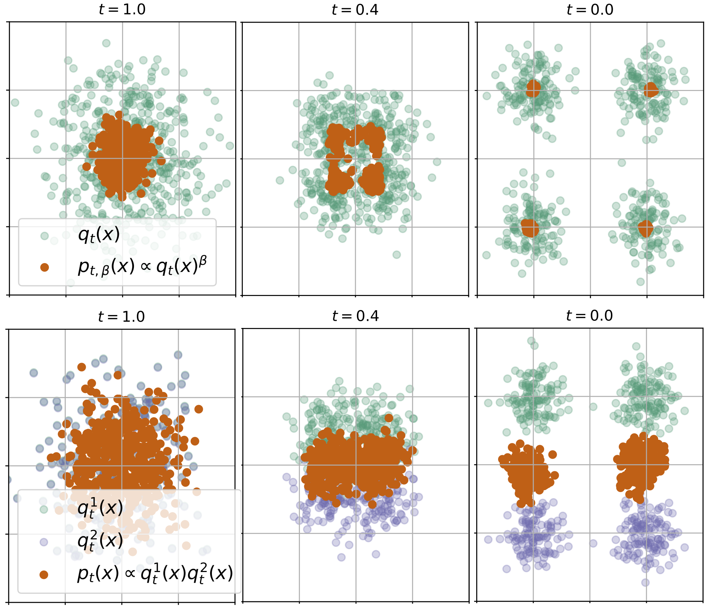

<h1 align="center">Feynman-Kac Correctors in Diffusion: Annealing, Guidance, and Product of Experts</h1>

<p align="center">
<a href="https://arxiv.org/abs/2503.02819"></a>
</p>

 We introduce an efficient and principled method for sampling from a sequence of annealed, geometric-averaged, or product distributions derived from pretrained score-based models. We derive a weighted simulation scheme, which we call Feynman-Kac Correctors (FKCs), based on the celebrated Feynman-Kac, formula by carefully accounting for terms in the appropriate partial differential equations (PDEs). We show the utility of FKC on applications in several domains: classical image generation, multi-conditional molecule design, and sampling from Boltzmann densities.

 <p align="center">
   
 </p>


## Code Layout

```
├── applications
│   ├── molecules
│   │    └── dual_target_sbdd
│   │        - code for generating 3D molecules conditioned on two protein pockets (FKC Product)
│   ├── temperature_annealing
│   │        - code for temperature annealing experiments on 2D GMMs & LJ-13 (FKC Annealing)
│   └── images
│            - coming soon! (FKC CFG)
└── notebooks
        - examples and notebooks for annealing/product on 2D Gaussians

```

### Introduction and Educational Notebooks

**Diffusion ([diffusion_edu.ipynb](/notebooks/diffusion_edu.ipynb)):** introduction to diffusion models

**Annealing ([diffusion_annealed.ipynb](/notebooks/diffusion_annealed.ipynb)):** toy example of FKC annealing incl. resampling code (prop 3.2)

**Product ([diffusion_product.ipynb](/notebooks/diffusion_product.ipynb)):** toy example of FKC product incl. resampling code (prop 3.3)


### Experiments

Each experiment has a different procedure and requires installing specific dependencies. Please follow the links below to run the code for each experiment:

- FKC CFG | Stable Diffusion (SD) XL: coming soon! (section 5.1)
- [FKC Annealing | Temperature Annealing](/applications/temperature_annealing/README.md): temperature annealing experiments on 2D GMMs and 13-particle Lennard-Jones potential (section 5.2)
- [FKC Product | Multi-Target Structure-Based Drug Design](/applications/molecules/dual_target_sbdd/README.md): generate 3D molecule simultaneously conditioned on two protein prockets using FKC product (section 5.3)

## Citation

<div align="left">

If you find this code useful in your research, please cite the following paper (expand for bibtex):

<details>
<summary>
M. Skreta*, T. Akhound-Sadegh*, V. Ohanesian*, R. Bondesan, A. Aspuru-Guzik, A. Doucet, R. Brekelmans, A. Tong, K. Neklyudov. Feynman-Kac Correctors in Diffusion: Annealing, Guidance, and Product of Experts, 2025.
</summary>


```bibtex
@article{skreta2025feynman,
  title={Feynman-Kac Correctors in Diffusion: Annealing, Guidance, and Product of Experts},
  author={Skreta, Marta and Akhound-Sadegh, Tara and Ohanesian, Viktor and Bondesan, Roberto and Aspuru-Guzik, Al{\'a}n and Doucet, Arnaud and Brekelmans, Rob and Tong, Alexander and Neklyudov, Kirill},
  journal={arXiv preprint arXiv:2503.02819},
  year={2025}
}
```
</details>

## Contribute

We welcome issues and pull requests (especially bug fixes) and contributions. We will try our best to improve readability and answer questions!

## Licences

This repo is licensed under the [MIT License](https://opensource.org/license/mit/).
