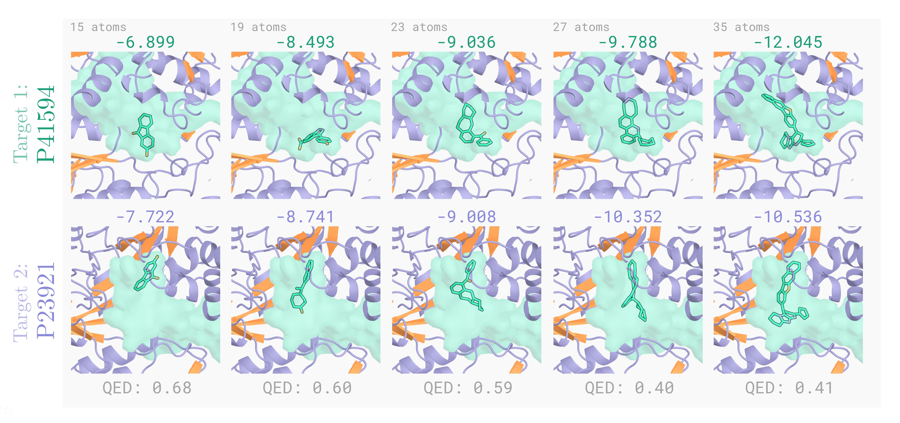

# FKC: Multi-Target Structure-Based Drug Design

<p align="center">
   
</p>

## Installation

Our codebase is adapted from [DualDiff](https://github.com/zhouxiangxin1998/DualDiff) and [TargetDiff](https://github.com/guanjq/targetdiff). Please follow DualDiff for installation instructions. An `environment.yml` file has been included (`conda env create -f environment.yml`).

Make sure that the current directory is listed in your `PYTHONPATH`: `export PYTHONPATH=$PYTHONPATH:$(pwd)`.

### Dataset

The dataset can be downloaded from [here](https://huggingface.co/datasets/zhouxiangxin/DualDiff). Download and uncompress it in this directory so that the file structures is `/path/to/dual_target_sbdd/data` (else set the `EXP_DIR` variable below with path of where it's located). 


### Model Checkpoint

The base model used in this study is TargetDiff. You can download it from [here](https://drive.google.com/drive/folders/1-ftaIrTXjWFhw3-0Twkrs5m0yX6CNarz?usp=share_link) and place it in the subdirectory `/path/to/dual_target_sbdd/pretrained_models` (if you change this path, update the config files in `configs`). 


## Multi-Target Structure-Based Drug Design

To generate samples based on two protein pockets, we first align the two pockets following [DualDiff](https://github.com/zhouxiangxin1998/DualDiff). This involves three steps:

### Step 1: Generate molecules for a single protein target (using [TargetDiff](https://github.com/guanjq/targetdiff))

```
idx1=8
idx2=226
numatoms=23
bs=32
seed=0
EXP_DIR="./"

python scripts/sample_for_pocket.py \
    configs/sampling_targetdiff.yml \
    --data_id $idx1 \
    --result_path ${EXP_DIR}/TEST_outputs/baseline_SDE_targetdiff_bs${bs}_fixednumatoms${numatoms}_seed${seed} \
    --num_samples $bs \
    --num_atoms_to_sample $numatoms \
    --experiment_dir ${EXP_DIR} \
    --seed $seed

```

- `idx1`, `idx2`: two protein ids to generate a target for (for a list of possible protein ids, see `data/processed/drug_synergy/synergy_idx_list.pkl`) (note that TargetDiff just requires one ID)
- `numatoms`: molecule size to generate
- `bs`: batch size and number of generated molecules
- `seed`: seed for reproduciility
- `EXP_DIR`: location of experiment directory where data subdirectory is located
- `result_path`: where to store results

### Step 2: Dock generated molecules from Step 1 to each protein `idx1`, `idx2`

```
python3 scripts/evaluate_targetdiff.py  \
    --result_path ${EXP_DIR}/TEST_outputs_prior/baseline_SDE_targetdiff_bs${bs}_fixednumatoms${numatoms}_seed${seed} \
    --experiment_dir ${EXP_DIR} \
    --sample_path ${EXP_DIR}/TEST_outputs/baseline_SDE_targetdiff_bs${bs}_fixednumatoms${numatoms}_seed${seed} \
    --idx1 $idx1 \
    --idx2 $idx1

python3 scripts/evaluate_targetdiff.py \
    --result_path ${EXP_DIR}/TEST_outputs_prior/baseline_SDE_targetdiff_bs${bs}_fixednumatoms${numatoms}_seed${seed} \
    --experiment_dir ${EXP_DIR} \
    --sample_path ${EXP_DIR}/TEST_outputs/baseline_SDE_targetdiff_bs${bs}_fixednumatoms${numatoms}_seed${seed} \
    --idx1 $idx1 \
    --idx2 $idx2

```
### Step 3: Align pockets of proteins `idx1`, `idx2`

```
python3 scripts/align_protein_ligand_score.py  \
    --results_dir ${EXP_DIR}/TEST_outputs_prior/baseline_SDE_targetdiff_bs${bs}_fixednumatoms${numatoms}_seed${seed} \
    --save_dir ${EXP_DIR}/TEST_aligned_SDE_prot_pockets_bs${bs}_fixednumatoms${numatoms}_seed${seed} \
    --experiment_dir ${EXP_DIR} \
    --idx1 $idx1 \
    --idx2 $idx2
```

An example of how to run this as a single workflow can be found in `bash_scripts/sample_targetdiff.sh` (e.g. `bash bash_scripts/sample_targetdiff.sh 8 226 23`)

Now that the pockets are aligned, we can generate molecules conditioned on two pockets simultaneously. 

### Step 4: Generate molecules for a protein pair  

```
idx1=8
idx2=226
numatoms=23
inv_temp=2.0
resample=0
thresh=0.6
num_steps=1000
seed=0
sample_num_atoms="fixed"
num_samples=32
exp_note=""

EXP_DIR="./"

python scripts/compose_sample_score.py \
        configs/sampling_fkc.yml \
    --idx1 $idx1 \
    --idx2 $idx2 \
    --num_atoms_to_sample $numatoms \
    --inv_temp $inv_temp \
    --num_steps $num_steps \
    --seed $seed \
    --sample_num_atoms $sample_num_atoms \
    --num_samples $num_samples \
    --resample $resample \
    --resample_thresh $thresh \
    --result_path ${EXP_DIR}/outputs/dualtarget_SDE_invtemp${inv_temp}_resample${resample}_bs${num_samples}_ns${num_steps}_seed${seed}_fixednumatoms${numatoms}${exp_note} \
    --aligned_prots_path ${EXP_DIR}/aligned_SDE_prot_pockets_bs${num_samples}_fixednumatoms${numatoms}_seed${seed} \
    --experiment_dir ${EXP_DIR}
```

- `idx1`, `idx2`: two protein ids to generate a target for (for a list of possible protein ids, see `data/processed/drug_synergy/synergy_idx_list.pkl`) (note that TargetDiff just requires one ID)
- `numatoms`: molecule size to generate
- `inv_temp`: inverse temperature (β in Proposition 3.3 of paper)
- `resample`: turn resampling (Feynmac-Kac Correctors) on/off (0: off, 1: on) 
- `thresh`: resampling threshold (% of steps to turn FKC on for) 
- `num_steps`: number of integration steps
- `seed`: seed for reproduciility
- `num_samples`: batch size and number of generated molecules
- `EXP_DIR`: location of experiment directory where data subdirectory is located
- `--result_path`: where to store results
- `--aligned_prots_path`: location to aligned protein pockets

### Step 5: Dock generated molecules from Step 4 to each protein `idx1`, `idx2`

```
python3 scripts/evaluate_compose.py --sample_path ${EXP_DIR}/TEST_outputs/dualtarget_SDE_invtemp${inv_temp}_resample${resample}_bs${num_samples}_ns${num_steps}_seed${seed}_fixednumatoms${numatoms}${exp_note} \
    --idx1 $idx1 \
    --idx2 $idx2 \
    --experiment_dir ${EXP_DIR}

```
An example of how to run this as a single workflow can be found in `bash_scripts/sample_fkc.sh` (e.g. `bash bash_scripts/sample_fkc.sh 8 226 23 2.0`)

## Evaluation 

To obtain aggregate metrics for all generated molecules, please see `evaluation/process_results.py` and modify the paths, ids, and molecule sizes on line 8 accordingly and then run `python3 evaluation/process_results.py`. You will also need to install [PyTDC](https://tdcommons.ai) with `pip install PyTDC` to evaluate diversity, QED, and SA. 

